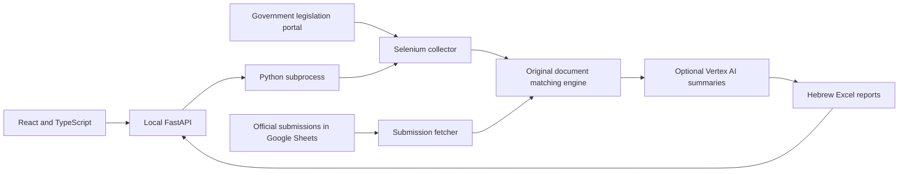

# Israel Regulatory Monitor

**[Open the interactive demo](https://guyhadadrosenblum.github.io/israel-regulatory-monitor/)** · [הוראות בעברית](docs/README.he.md)

A regulatory-monitoring tool built by **Guy Hadad Rosenblum** for the Israeli Regulatory Authority: collect new legislative publications, cross-reference official submissions, and turn the results into reports for the team.

## Why I built it

During my work at the Authority, I identified a repetitive workflow: continuously checking the government legislation website and comparing new publications against official submissions. I built and introduced a tool to automate collection, document matching and reporting. It saved manual work; this repository does not claim a numerical time-saving estimate without recorded measurements.

This edition adds a React/TypeScript interface around the original Python processing engine. The public demo uses clearly labelled synthetic records, requires no account or API keys, and illustrates the workflow without calling paid services.

## Try it

In the [demo](https://guyhadadrosenblum.github.io/israel-regulatory-monitor/), filter publications by ministry or matching status, open a record, export CSV, run the five-stage demonstration, or edit two Hebrew texts in **על הפרויקט** to see their Jaccard similarity calculated immediately. The demonstration animation does not execute the Python pipeline or live AI calls.

## Run locally

With Docker Compose installed:

```sh
git clone https://github.com/GuyHadadRosenblum/israel-regulatory-monitor.git
cd israel-regulatory-monitor
docker compose up --build
```

Open **http://localhost:8000**. Demo mode works without credentials. Docker is optional; local source instructions follow below. Compose binds only to loopback: the backend is designed for a single trusted local operator, not an unauthenticated public server.

### Connect live sources

1. Copy `.env.example` to `.env`.
2. Put your own Google service-account JSON in `config/` (create the directory if needed). Both `.env` and these JSON files are ignored by Git.
3. Set `GOOGLE_APPLICATION_CREDENTIALS` to its path. For Docker use `/app/config/your-key.json`; for local Python use `config/your-key.json`.
4. Share the submissions spreadsheet with that service account. Set `GOOGLE_SHEETS_ID` or `GOOGLE_SHEETS_NAME`.
5. Optionally enable `ENABLE_AI=true` and set `GOOGLE_CLOUD_PROJECT`, location and model. Vertex AI must be enabled and the account authorized. AI calls may incur charges.
6. Restart the server and select **הפעלה אמיתית** in the interface. Choose a start date and run monitoring.

The backend runs the original five steps in a separate Python process, saves job status and logs in `data/web-jobs/`, and reports a failure rather than marking failed stages successful. Only one monitoring job can run at a time. A backend restart can interrupt a run; interrupted status is reported as failed rather than resumed automatically. Existing source caches are retained; the chosen date controls the scan, not a deletion of historical records. AI is optional and disabled by default.

### Run from source

Requires Python 3.12+, Node 22+, pnpm 11.19.0 and Chrome/Chromium for live scraping.

```sh
python -m venv .venv
# Windows: .venv\Scripts\activate
# macOS/Linux: source .venv/bin/activate
pip install -r requirements-dev.txt -c requirements.lock
cd frontend
pnpm install --frozen-lockfile
pnpm build
cd ..
python main.py
```

For UI development run `pnpm dev` in `frontend` while the API runs on port 8000. For a static portfolio build use `VITE_DEMO_ONLY=true pnpm build` (PowerShell: `$env:VITE_DEMO_ONLY='true'; pnpm build`). No credentials belong in `VITE_*` variables: frontend variables are public.

## Architecture



The matching engine selects candidates by ministry and a 120-day date window, extracts PDF/DOCX text, and measures Jaccard word-set overlap. The existing acceptance threshold is 55%. **A similarity score is not a probability or a guarantee of correctness.** Scanned documents without text require additional OCR work; no OCR accuracy is claimed here. AI classifications are provisional and require human review.

The new interface supports monitoring, result inspection, Excel export and a Monday upload that calculates 14/74-day target dates. The original scripts remain available for the more specialized organizational outputs:

```sh
python -m src.gantt_maker
python -m src.Regulation_current_table_generator
```

Gantt inputs live in `data/gantt and tracking table/monday_table/`. Historical regulation-table inputs live under `data/Regulation current table/old Regulation current table/` and `monday_table/`; optional row mappings live in `מיקומי שורות בבירור/`. These scripts require the original export schemas; their full historical workflow is not reproduced in the public demo. `src/dashboard_app.py` preserves the former Streamlit UI for reference.

## Verification

```sh
python -m pytest -q
cd frontend
pnpm test
pnpm build
```

Regression tests exercise the original matching engine with generated DOCX files, verify Hebrew Excel output, test API validation and failed-run status, and check Monday date calculations. Frontend tests verify matching math, compound filters and safe CSV quoting. GitHub Actions runs the tests and builds the public demo. See [verification notes](docs/verification.md) for the limits of live validation.

## Credentials and deployment

No Google private keys, Telegram bot tokens, `.env` files or local downloads are published. Telegram delivery is explicitly opt-in and reads a locally managed subscriber list; the public demo never sends messages. Any previously exposed credentials should be rotated by their owner.

GitHub Pages hosts only the static demo. It cannot run Selenium or Python. The complete source can be run locally with operator-supplied credentials; hosting the live service would additionally require authentication, a durable job queue and deployment-specific controls.

This is a personal project presentation, not an official government service. Source code is available under the MIT license; third-party dependencies retain their own licenses.
